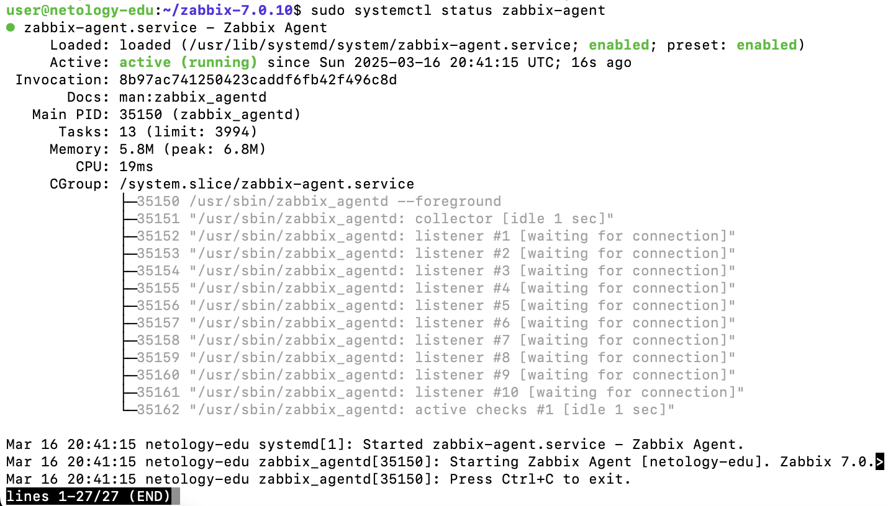

# Домашнее задание к занятию «Управление пакетами»

### Цель задания

В результате выполнения этого задания вы закрепите свои знания об устройстве репозиториев, а также:
* научитесь устанавливать пакеты,
* научитесь собирать пакеты из исходников.

### Инструкция к заданию

1. Домашнее задание выполните в [Google Docs](https://docs.google.com/) и отправьте на проверку ссылку на ваш документ в личном кабинете.
2. В названии файла введите корректное название лекции и вашу фамилию и имя.
3. Зайдите в настройки доступа и выберите доступ «Просматривать могут все в интернете, у кого есть ссылка».
 Ссылка на инструкцию, [как предоставить доступ к файлам и папкам на Google Диске](https://support.google.com/docs/answer/2494822?hl=ru&co=GENIE.Platform%3DDesktop).
5. Скопируйте текст задания в свой документ.
6. Выполните домашнее задание, запишите ответы и приложите необходимые скриншоты в свой Google Документ.
7. Для проверки домашнего задания преподавателем отправьте ссылку на ваш документ в личном кабинете.
8. Любые вопросы по решению задач задавайте в чате учебной группы.


### Задание 1

Опишите достоинства и недостатки работы с пакетным менеджером и репозиторием.

*Напишите ответ в свободной форме.*


### Задание 2

Ответьте на вопросы:
* какие действия надо выполнить при подключении стороннего репозитория,
* в чём опасность такого способа распространения ПО и как это решить.

*Напишите ответ в свободной форме.*


### Задание 3

1. Запустите свою виртуальную машину.
2. Найдите в репозиториях и установите пакет `htop`.

Какие зависимости требует `htop`?

*Ответ приведите в виде текста команды, которой вы это выполнили, а также приложите скриншот места расположения исполняемых файлов установленного ПО.*


### Задание 4

1. Подключите репозиторий PHP и установите PHP 8.0.

*Приложите скриншот содержимого файла, в котором записан адрес репозитория.*

2. При помощи команды `php -v` убедитесь, что поставлена корректная версия PHP.

*Приложите к ответу скриншот версии.*


### Задание 5

Ваш коллега-программист просит вас установить модуль `google-api-python-client` на сервер, который необходим для программы, работающей с Google API.

Установите этот пакет при помощи менеджера пакетов `pip`.

**Примечение №1:** для установки может понадобиться пакет `python-distutils`, проверьте его наличие в системе.

**Примечение №2:** если возникнет ошибка при установке с помощью Python версии 2, воспользуйтесь командой `python3`.

*Приложите скриншоты  с установленным пакетом `python-distutils`, с версией `Pip` и установленными модулями, они должны быть видимы.*

---

**

## Дополнительные задания (со звёздочкой*)
Эти задания дополнительные и не обязательны к выполнению, они никак не повлияют на получение вами зачёта по этому домашнему заданию. Вы можете их выполнить, если хотите глубже разобраться в материале.

### Задание 6*

1. Перечислите менеджеры пакетов, кроме тех, о которых говорилось на лекции.
В каких дистрибутивах они работают?

2. Есть ли альтернативные менеджеры для тех, которые разбирались на лекции?

*Напишите ответ в свободной форме.*


### Задание 7*

1. Скачайте исходники Zabbix и соберите Zabbix Agent для того дистрибутива, на котором вы работаете.
2. Установите его при помощи менеджера пакетов.

*Ответ приведите в виде скриншота.*

### Решение 7

Вот полное пошаговое решение задания №7 с подробным описанием каждого этапа:

⸻

### 1: Подготовка системы и установка зависимостей

Сначала обновите пакеты и установите инструменты, необходимые для сборки программного обеспечения:
```bash
sudo apt update && sudo apt upgrade -y
sudo apt install -y build-essential gcc make autoconf libc6-dev pkg-config wget libpcre3-dev pkg-config
```
Эти команды установят:
	•	gcc (компилятор С)
	•	make (утилита для сборки программ)
	•	autoconf (для настройки сборки ПО)
	•	build-essential (набор пакетов для компиляции программ)

⸻

### 2: Скачивание исходников Zabbix Agent

Скачайте исходные файлы последней стабильной версии Zabbix Agent (например, 7.0.10):
```bash
wget https://cdn.zabbix.com/zabbix/sources/stable/7.0/zabbix-7.0.10.tar.gz
```
Распакуйте архив и перейдите в созданную директорию:
```bash
tar -xvzf zabbix-7.0.10.tar.gz
cd zabbix-7.0.10
```


⸻

### 3: Сборка Zabbix Agent из исходников

Теперь необходимо сконфигурировать и собрать агент:
```bash
./configure --enable-agent
make -j$(nproc)
sudo make install
```
📌 Пояснение команд:
	•	./configure --enable-agent — подготовка исходников к сборке агента.
	•	make -j$(nproc) — компиляция кода (параметр -j$(nproc) ускоряет процесс, используя все доступные ядра процессора).
	•	sudo make install — установка скомпилированного Zabbix Agent в систему.

⸻

### 4: Установка Zabbix Agent с помощью менеджера пакетов

Дополнительно установите официальный пакет агента через менеджер пакетов для удобного управления сервисом и получения системных файлов для запуска:
```bash
sudo apt install -y zabbix-agent
sudo systemctl enable --now zabbix-agent
```
Эти команды установят агент и запустят его как системную службу.

⸻

### 5: Проверка работоспособности Zabbix Agent

Убедитесь, что агент успешно установлен и запущен:
```bash
sudo systemctl status zabbix-agent
```


### Задание 8*

1. Скачайте исходники Zabbix и соберите Zabbix Server для того дистрибутива, на котором вы работаете.
2. Установите его при помощи менеджера пакетов.

*Ответ приведите в виде скриншота.*

### Решение 8

### 1. Скачивание и сборка Zabbix Server

#### Установка необходимых зависимостей
Перед установкой убедитесь, что все пакеты обновлены:
```bash
sudo apt update && sudo apt upgrade -y
```
Затем установите необходимые пакеты:
```bash
sudo apt install -y build-essential gcc make autoconf libc6-dev \
    postgresql postgresql-contrib libpq-dev libcurl4-openssl-dev \
    pkg-config curl wget libsnmp-dev snmp libpcre3-dev pkg-config \
    libevent-dev libpcre2-dev libxml2-dev dh-autoreconf
```

---

### 2. Установка и настройка PostgreSQL
Запустите и включите PostgreSQL:
```bash
sudo systemctl enable --now postgresql
```
Подключение к PostgreSQL как пользователь `postgres`:
```bash
sudo -i -u postgres psql
```
Создайте пользователя и базу данных:
```sql
CREATE ROLE zabbix WITH LOGIN PASSWORD 'zabbix_password';
CREATE DATABASE zabbix OWNER zabbix;
GRANT ALL PRIVILEGES ON DATABASE zabbix TO zabbix;
ALTER DATABASE zabbix SET timezone TO 'UTC';
\q
```

---

### 3. Создание системного пользователя Zabbix
```bash
sudo useradd -r -s /bin/false zabbix
```

---

### 4. Скачивание исходников Zabbix
```bash
wget https://cdn.zabbix.com/zabbix/sources/stable/7.0/zabbix-7.0.10.tar.gz
tar -xvzf zabbix-7.0.10.tar.gz
cd zabbix-7.0.10
```

---

### 5. Сборка Zabbix Server
```bash
./configure --enable-server --enable-agent \
    --with-postgresql --with-net-snmp --with-libcurl
make -j$(nproc)
sudo make install
```

---

### 6. Импорт схемы базы данных Zabbix

Переход в каталог с SQL-скриптами
```bash
cd database/postgresql/
```
Импорт структуры базы данных

Теперь импортируем файлы с SQL-скриптами от имени пользователя postgres, который обладает достаточными правами:
```bash
sudo -u postgres psql zabbix < schema.sql
sudo -u postgres psql zabbix < images.sql
sudo -u postgres psql zabbix < data.sql
```

📌 Что делает каждый файл?
	•	schema.sql — создаёт таблицы и индексы.
	•	images.sql — загружает изображения, используемые в веб-интерфейсе Zabbix.
	•	data.sql — импортирует предустановленные данные, такие как настройки и шаблоны.

💡 Можно ли выполнить импорт от имени пользователя zabbix?
Нет, потому что при установке базы владельцем всех таблиц становится postgres. Поэтому сначала мы загружаем данные от имени postgres, а затем изменяем владельца всех таблиц на zabbix.

⸻

Шаг 3: Выдача прав пользователю zabbix

Теперь подключимся к базе данных:

```bash
sudo -u postgres psql -d zabbix
```
И выдадим все необходимые права:
```psql
GRANT ALL PRIVILEGES ON DATABASE zabbix TO zabbix;
GRANT USAGE, CREATE ON SCHEMA public TO zabbix;
GRANT ALL PRIVILEGES ON ALL TABLES IN SCHEMA public TO zabbix;
GRANT ALL PRIVILEGES ON ALL SEQUENCES IN SCHEMA public TO zabbix;
GRANT ALL PRIVILEGES ON ALL FUNCTIONS IN SCHEMA public TO zabbix;
ALTER DEFAULT PRIVILEGES IN SCHEMA public GRANT ALL ON TABLES TO zabbix;
ALTER DEFAULT PRIVILEGES IN SCHEMA public GRANT ALL ON SEQUENCES TO zabbix;
ALTER DEFAULT PRIVILEGES IN SCHEMA public GRANT ALL ON FUNCTIONS TO zabbix;
```

🔹 Почему это нужно?
	•	Zabbix-сервер выполняет SQL-запросы от имени пользователя zabbix, и ему нужно иметь полный доступ ко всем объектам базы.
	•	Мы также устанавливаем права по умолчанию, чтобы все будущие объекты (таблицы, функции, последовательности) сразу создавались с правами для zabbix.

⸻

Шаг 4: Изменение владельца всех объектов базы данных

При импорте данных владельцем всех объектов (tables, sequences, functions) остаётся postgres. Чтобы Zabbix мог их полноценно использовать, мы передаём владение пользователю zabbix.

Изменение владельца всех таблиц
```psql
DO $$
DECLARE r RECORD;
BEGIN
    FOR r IN (SELECT tablename FROM pg_tables WHERE schemaname = 'public')
    LOOP
        EXECUTE 'ALTER TABLE ' || quote_ident(r.tablename) || ' OWNER TO zabbix';
    END LOOP;
END $$;
```
Изменение владельца всех последовательностей
```psql
DO $$
DECLARE r RECORD;
BEGIN
    FOR r IN (SELECT sequence_name FROM information_schema.sequences WHERE sequence_schema = 'public')
    LOOP
        EXECUTE 'ALTER SEQUENCE ' || quote_ident(r.sequence_name) || ' OWNER TO zabbix';
    END LOOP;
END $$;
```
Изменение владельца всех функций
```psql

DO $$
DECLARE r RECORD;
BEGIN
    FOR r IN (SELECT routine_name FROM information_schema.routines WHERE routine_schema = 'public')
    LOOP
        EXECUTE 'ALTER FUNCTION ' || quote_ident(r.routine_name) || ' OWNER TO zabbix';
    END LOOP;
END $$;
```

После успешного выполнения команд выйдите из консоли PostgreSQL:
```psql
\q
```
---

### 7. Настройка конфигурации Zabbix
Редактируем файл конфигурации:
```bash
sudo nano /usr/local/etc/zabbix_server.conf
```
Изменяем параметры:
```ini
DBName=zabbix
DBUser=zabbix
DBPassword=zabbix_password
PidFile=/run/zabbix/zabbix_server.pid
```
Сохраняем изменения и выходим.

---

### 8. Настройка прав доступа
```bash
sudo chown -R zabbix:zabbix /usr/local/etc/zabbix_server.conf
sudo mkdir -p /run/zabbix
sudo chown -R zabbix:zabbix /run/zabbix
sudo chmod 755 /run/zabbix

```

---

### 9. Перезагрузка systemd
```bash
sudo systemctl daemon-reload
```

---

### 10. Создание службы Zabbix Server
```bash
sudo nano /etc/systemd/system/zabbix-server.service
```
Добавляем:
```ini
[Unit]
Description=Zabbix Server
After=network.target postgresql.service

[Service]
Type=forking
ExecStart=/usr/local/sbin/zabbix_server
PIDFile=/run/zabbix/zabbix_server.pid
Restart=on-failure

[Install]
WantedBy=multi-user.target
```
Сохраняем и выходим.

Запускаем службу:
```bash
sudo systemctl daemon-reload
sudo systemctl enable --now zabbix-server
```

---

### 11. Проверка работы
```bash
sudo systemctl status zabbix-server
```


