# Домашнее задание к занятию «Kubernetes. Часть 1»

Это задание для самостоятельной отработки навыков и не предполагает обратной связи от преподавателя. Его выполнение не влияет на завершение модуля. Но мы рекомендуем его выполнить, чтобы закрепить полученные знания.

### Задание 1

**Выполните действия:**

1. Запустите Kubernetes локально, используя k3s или minikube на свой выбор.
1. Добейтесь стабильной работы всех системных контейнеров.

### Решение 1

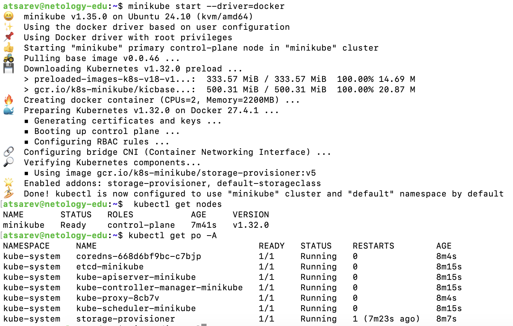

### Задание 2

Есть файл с деплоем:

```
apiVersion: apps/v1
kind: Deployment
metadata:
  name: redis
spec:
  selector:
    matchLabels:
      app: redis
  replicas: 1
  template:
    metadata:
      labels:
        app: redis
    spec:
      containers:
      - name: master
        image: bitnami/redis
        env:
         - name: REDIS_PASSWORD
           value: password123
        ports:
        - containerPort: 6379
```


**Выполните действия:**

1. Измените файл с учётом условий:

 * redis должен запускаться без пароля;
 * создайте Service, который будет направлять трафик на этот Deployment;
 * версия образа redis должна быть зафиксирована на 6.0.13.

2. Запустите Deployment в своём кластере и добейтесь его стабильной работы.

### Решение 2
Для выполнения задачи создадим два файла: 

`redis-deployment.yaml` и `redis-service.yaml`. 

---

### **1. Файл `redis-deployment.yaml`**
```yaml
apiVersion: apps/v1
kind: Deployment
metadata:
  name: redis
  labels:
    app: redis
spec:
  replicas: 1
  selector:
    matchLabels:
      app: redis
  template:
    metadata:
      labels:
        app: redis
    spec:
      containers:
      - name: redis
        image: bitnami/redis:6.0.13
        ports:
        - containerPort: 6379
        env:
        - name: ALLOW_EMPTY_PASSWORD
          value: "yes"
```

**Объяснение:**
- Используется образ `bitnami/redis:6.0.13`.
- Переменная `ALLOW_EMPTY_PASSWORD` установлена в `yes`, чтобы Redis работал без пароля.
- Порт 6379 открыт для подключения.

---

### **2. Файл `redis-service.yaml`**
```yaml
apiVersion: v1
kind: Service
metadata:
  name: redis-service
spec:
  selector:
    app: redis
  ports:
    - protocol: TCP
      port: 6379
      targetPort: 6379
  type: ClusterIP
```

**Объяснение:**
- `ClusterIP` создаёт внутренний сервис для перенаправления трафика на Pod Redis.
- Порт 6379 используется для подключения к Redis.

---

### **3. Применение манифестов**
1. **Примените Deployment:**
   ```bash
   kubectl apply -f redis-deployment.yaml
   ```

2. **Примените Service:**
   ```bash
   kubectl apply -f redis-service.yaml
   ```

3. **Проверьте статус ресурсов:**
   ```bash
   kubectl get deployments
   kubectl get services
   kubectl get pods
   ```
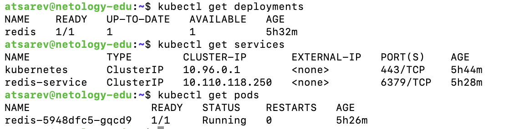

---

### **4. Проверка работы Redis**
1. **Создайте временный Pod для подключения к Redis:**
   ```bash
   kubectl run -it --rm redis-client --image=bitnami/redis:6.0.13 -- bash
   ```

2. **Подключитесь к Redis:**
   Внутри временного Pod выполните:
   ```bash
   redis-cli -h redis-service
   ```

3. **Проверьте подключение:**
   Введите команду:
   ```plaintext
   PING
   ```
   Ожидаемый результат:
   ```plaintext
   PONG
   ```
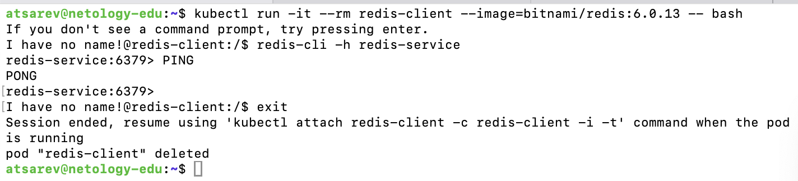

### Задание 3

**Выполните действия:**

1. Напишите команды kubectl для контейнера из предыдущего задания:

 - выполнения команды ps aux внутри контейнера;
 - просмотра логов контейнера за последние 5 минут;
 - удаления контейнера;
 - проброса порта локальной машины в контейнер для отладки.

### Решение 3


### **1. Выполнение команды `ps aux` внутри контейнера**
```bash
kubectl exec -it <pod-name> -- ps aux
```

- **Пример** (с заменой `<pod-name>` на имя Pod Redis, например, `redis-5948dfc5-gqcd9`):
  ```bash
  kubectl exec -it redis-5948dfc5-gqcd9 -- ps aux
  ```
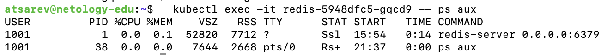

---

### **2. Просмотр логов контейнера за последние 5 минут**
```bash
kubectl logs <pod-name> --since=5m
```

- **Пример**:
  ```bash
  kubectl logs redis-5948dfc5-gqcd9 --since=5m
  ```
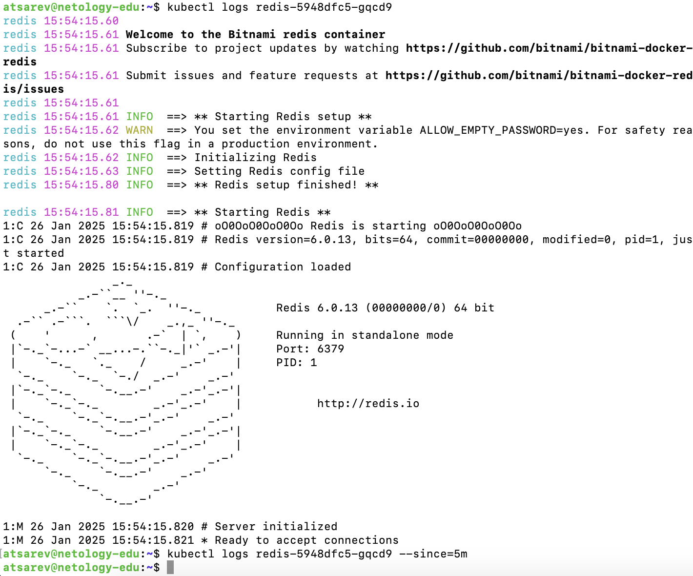

---

### **3. Удаление контейнера (Pod)**
```bash
kubectl delete pod <pod-name>
```

- **Пример**:
  ```bash
  kubectl delete pod redis-5948dfc5-gqcd9
  ```

> **Примечание:** Если этот Pod управляется `Deployment`, Kubernetes автоматически создаст новый Pod взамен удалённого. Чтобы предотвратить это, можно удалить весь `Deployment`:
```bash
kubectl delete deployment redis
```
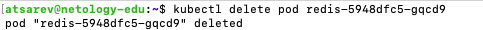

---

### **4. Проброс порта локальной машины в контейнер для отладки**
```bash
kubectl port-forward <pod-name> <local-port>:<container-port>
```

- **Пример**:
  ```bash
  kubectl port-forward redis-5948dfc5-gqcd9 6379:6379
  ```

Теперь вы можете подключаться к Redis через `localhost:6379`:
```bash
redis-cli -h 127.0.0.1 -p 6379
```
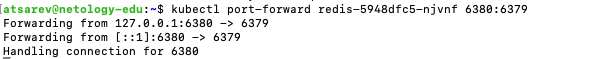
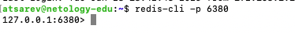

### Задание 4

Есть конфигурация nginx:

```
location / {
    add_header Content-Type text/plain;
    return 200 'Hello from k8s';
}
```

**Выполните действия:**

Напишите yaml-файлы для развёртки nginx, в которых будут присутствовать:

 - ConfigMap с конфигом nginx;
 - Deployment, который бы подключал этот configmap;
 - Ingress, который будет направлять запросы по префиксу /test на наш сервис.

### Решение 4

Вот YAML-файлы для выполнения задания.

---

### **1. ConfigMap с конфигурацией Nginx**
Создайте `nginx-configmap.yaml`:

```yaml
apiVersion: v1
kind: ConfigMap
metadata:
  name: nginx-config
  namespace: default
data:
  default.conf: |
    server {
        listen 80;
        location / {
            add_header Content-Type text/plain;
            return 200 'Hello from k8s';
        }
    }
```

**Объяснение:**
- `default.conf` содержит конфигурацию Nginx, которая отвечает на запросы с сообщением `Hello from k8s`.

---

### **2. Deployment для Nginx**
Создайте `nginx-deployment.yaml`:

```yaml
apiVersion: apps/v1
kind: Deployment
metadata:
  name: nginx-deployment
  namespace: default
spec:
  replicas: 1
  selector:
    matchLabels:
      app: nginx
  template:
    metadata:
      labels:
        app: nginx
    spec:
      containers:
      - name: nginx
        image: nginx:1.21.6
        ports:
        - containerPort: 80
        volumeMounts:
        - name: nginx-config-volume
          mountPath: /etc/nginx/conf.d
          readOnly: true
      volumes:
      - name: nginx-config-volume
        configMap:
          name: nginx-config
```

**Объяснение:**
- Подключается `ConfigMap` (`nginx-config`) в качестве тома и монтируется в `/etc/nginx/conf.d`.
- Используется официальный образ `nginx:1.21.6`.

---

### **3. Service для Nginx**
Создайте `nginx-service.yaml`:

```yaml
apiVersion: v1
kind: Service
metadata:
  name: nginx-service
  namespace: default
spec:
  selector:
    app: nginx
  ports:
  - protocol: TCP
    port: 80
    targetPort: 80
```

**Объяснение:**
- Service открывает доступ к Nginx на порту `80` внутри кластера.

---

### **4. Ingress для маршрутизации**
Создайте `nginx-ingress.yaml`:

```yaml
apiVersion: networking.k8s.io/v1
kind: Ingress
metadata:
  name: nginx-ingress
  namespace: default
  annotations:
    nginx.ingress.kubernetes.io/rewrite-target: /
spec:
  rules:
  - http:
      paths:
      - path: /test
        pathType: Prefix
        backend:
          service:
            name: nginx-service
            port:
              number: 80
```

**Объяснение:**
- Ingress перенаправляет запросы с префиксом `/test` на `nginx-service`.

---

### **Применение файлов**
1. Сохраните файлы с именами:
   - `nginx-configmap.yaml`
   - `nginx-deployment.yaml`
   - `nginx-service.yaml`
   - `nginx-ingress.yaml`

2. Примените файлы:
   ```bash
   kubectl apply -f nginx-configmap.yaml
   kubectl apply -f nginx-deployment.yaml
   kubectl apply -f nginx-service.yaml
   kubectl apply -f nginx-ingress.yaml
   ```

---

### **Проверка работы**
1. Убедитесь, что все ресурсы созданы:
   ```bash
   kubectl get pods,svc,ingress
   ```
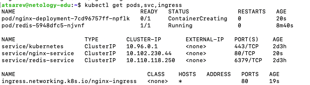

2. Мы используем Minikube, надо включить Ingress-контроллер:
   ```bash
   minikube addons enable ingress
   ```
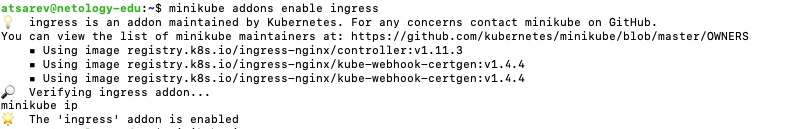

3. Получите IP-адрес Minikube:
   ```bash
   minikube ip
   ```
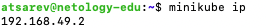

4. Проверим через curl:
   ```plaintext
   http://<minikube-ip>/test
   ```

Ожидаемый результат: сообщение `Hello from k8s`

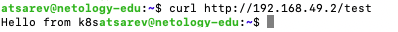
