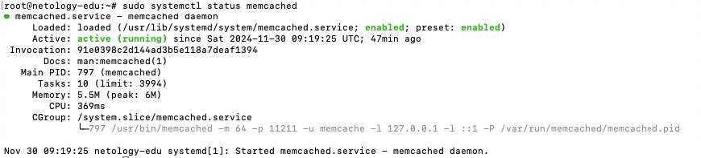
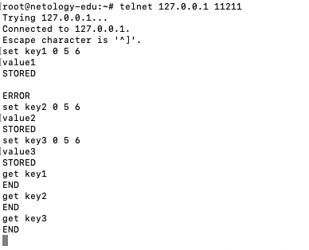
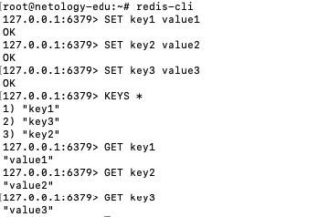

# Домашнее задание к занятию «Кеширование Redis/memcached»

### Задание 1. Кеширование 

Приведите примеры проблем, которые может решить кеширование. 

### Решение 1. 

1. **Ускорение работы веб-приложений**

• **Проблема:** Запросы к базе данных для получения одних и тех же данных занимают значительное время.

• **Решение:** Часто запрашиваемые данные (например, список товаров или результаты поиска) можно хранить в кеше, чтобы не обращаться к базе данных при каждом запросе.

2. **Снижение нагрузки на сервер базы данных**

• **Проблема:** Высокая нагрузка на базу данных из-за большого количества пользователей или сложных запросов.

• **Решение:** Кеширование результатов запросов позволяет уменьшить количество обращений к базе данных.

3. **Обеспечение доступности данных при сбоях**

• **Проблема:** Основная база данных недоступна из-за сбоя или временных проблем с подключением.

• **Решение:** Кешированные данные могут использоваться как временное решение для предоставления пользователям данных до восстановления основной базы данных.

4. **Ускорение загрузки страниц в веб-приложениях**

• **Проблема:** Долгая загрузка страниц из-за большого количества данных, которые нужно обработать и отобразить.

• **Решение:** Использование кеша для хранения заранее сгенерированных страниц или их частей (например, популярных страниц или элементов интерфейса).

5. **Улучшение производительности API**

• **Проблема:** Частые обращения к API для получения идентичных данных создают задержки и нагрузку.

• **Решение:** Кеширование ответов API позволяет вернуть результат быстрее без обращения к основным сервисам.

6. **Снижение затрат на вычисления**

• **Проблема:** Частые вычисления (например, сложные аналитические расчёты или агрегации) занимают много ресурсов.

• **Решение:** Результаты вычислений можно закешировать, чтобы избежать повторных операций.

7. **Ускорение поиска**

• **Проблема:** Медленный поиск в больших объёмах данных.

• **Решение:** Результаты поиска или промежуточные данные для индексации можно хранить в кеше для быстрого доступа.

8. **Снижение задержек в распределённых системах**

• **Проблема:** В распределённых системах данные могут быть доступны с задержками из-за физического расстояния между компонентами.

• **Решение:** Локальный кеш позволяет быстрее получать данные без обращения к удалённым узлам.

---

### Задание 2. Memcached

Установите и запустите memcached.

*Приведите скриншот systemctl status memcached, где будет видно, что memcached запущен.*

### Решение 2. 

---

### Задание 3. Удаление по TTL в Memcached

Запишите в memcached несколько ключей с любыми именами и значениями, для которых выставлен TTL 5. 

*Приведите скриншот, на котором видно, что спустя 5 секунд ключи удалились из базы.*

### Решение 3. 

---

### Задание 4. Запись данных в Redis

Запишите в Redis несколько ключей с любыми именами и значениями. 

*Через redis-cli достаньте все записанные ключи и значения из базы, приведите скриншот этой операции.*

### Решение 4. 

## Дополнительные задания (со звёздочкой*)
Эти задания дополнительные, то есть не обязательные к выполнению, и никак не повлияют на получение вами зачёта по этому домашнему заданию. Вы можете их выполнить, если хотите глубже разобраться в материале.

### Задание 5*. Работа с числами 

Запишите в Redis ключ key5 со значением типа "int" равным числу 5. Увеличьте его на 5, чтобы в итоге в значении лежало число 10.  

*Приведите скриншот, где будут проделаны все операции и будет видно, что значение key5 стало равно 10.*
