#  Дипломная работа по профессии «Системный администратор» - Царев Андрей

## Задача
Содержание
==========

## Задача
Ключевая задача — разработать отказоустойчивую инфраструктуру для сайта, включающую мониторинг, сбор логов и резервное копирование основных данных. Инфраструктура должна размещаться в [Yandex Cloud](https://cloud.yandex.com/) и отвечать минимальным стандартам безопасности: запрещается выкладывать токен от облака в git.

## Инфраструктура
Для развёртки инфраструктуры используйте Terraform и Ansible.  

Не используйте для ansible inventory ip-адреса! Вместо этого используйте fqdn имена виртуальных машин в зоне ".ru-central1.internal". Пример: example.ru-central1.internal  


### Сайт
Создайте две ВМ в разных зонах, установите на них сервер nginx, если его там нет. ОС и содержимое ВМ должно быть идентичным, это будут наши веб-сервера.

Используйте набор статичных файлов для сайта. Можно переиспользовать сайт из домашнего задания.

Создайте [Target Group](https://cloud.yandex.com/docs/application-load-balancer/concepts/target-group), включите в неё две созданных ВМ.

Создайте [Backend Group](https://cloud.yandex.com/docs/application-load-balancer/concepts/backend-group), настройте backends на target group, ранее созданную. Настройте healthcheck на корень (/) и порт 80, протокол HTTP.

Создайте [HTTP router](https://cloud.yandex.com/docs/application-load-balancer/concepts/http-router). Путь укажите — /, backend group — созданную ранее.

Создайте [Application load balancer](https://cloud.yandex.com/en/docs/application-load-balancer/) для распределения трафика на веб-сервера, созданные ранее. Укажите HTTP router, созданный ранее, задайте listener тип auto, порт 80.

Протестируйте сайт
`curl -v <публичный IP балансера>:80` 

### Мониторинг
Создайте ВМ, разверните на ней Zabbix. На каждую ВМ установите Zabbix Agent, настройте агенты на отправление метрик в Zabbix. 

Настройте дешборды с отображением метрик, минимальный набор — по принципу USE (Utilization, Saturation, Errors) для CPU, RAM, диски, сеть, http запросов к веб-серверам. Добавьте необходимые tresholds на соответствующие графики.

### Логи
Cоздайте ВМ, разверните на ней Elasticsearch. Установите filebeat в ВМ к веб-серверам, настройте на отправку access.log, error.log nginx в Elasticsearch.

Создайте ВМ, разверните на ней Kibana, сконфигурируйте соединение с Elasticsearch.

### Сеть
Разверните один VPC. Сервера web, Elasticsearch поместите в приватные подсети. Сервера Zabbix, Kibana, application load balancer определите в публичную подсеть.

Настройте [Security Groups](https://cloud.yandex.com/docs/vpc/concepts/security-groups) соответствующих сервисов на входящий трафик только к нужным портам.

Настройте ВМ с публичным адресом, в которой будет открыт только один порт — ssh.  Эта вм будет реализовывать концепцию  [bastion host]( https://cloud.yandex.ru/docs/tutorials/routing/bastion) . Синоним "bastion host" - "Jump host". Подключение  ansible к серверам web и Elasticsearch через данный bastion host можно сделать с помощью  [ProxyCommand](https://docs.ansible.com/ansible/latest/network/user_guide/network_debug_troubleshooting.html#network-delegate-to-vs-proxycommand) . Допускается установка и запуск ansible непосредственно на bastion host.(Этот вариант легче в настройке)

### Резервное копирование
Создайте snapshot дисков всех ВМ. Ограничьте время жизни snaphot в неделю. Сами snaphot настройте на ежедневное копирование.

--------
---


# Выполнение дипломной работы

## Инфраструктура

### Развёртывание инфраструктуры с помощью Terraform

### Подготовка к развёртыванию инфраструктуры

Для работы с облачной инфраструктурой в Yandex Cloud с использованием Terraform выполнены следующие шаги:

### 1. Установка Terraform
•	Скачайте и установите Terraform актуальной версии

•	Проверка версии Terraform:
```
./terraform -v
```

### 2. Настройка Terraform

•	Создание конфигурационного файла ~/.terraformrc:
```
vim ~/.terraformrc
chmod 644 ~/.terraformrc
```
•	Добавление данных в файл .terraformrc:
```
provider_installation {
  network_mirror {
    url = "https://terraform-mirror.yandexcloud.net/"
    include = ["registry.terraform.io/*/*"]
  }
  direct {
    exclude = ["registry.terraform.io/*/*"]
  }
}
```


3. Настройка конфигурационных файлов проекта

	•	Создание файлов 

    main.tf 

    meta.yaml


4. Инициализация Terraform

	•	Выполнение инициализации в директории проекта:
```
./terraform init
```


Пример вывода при успешной инициализации
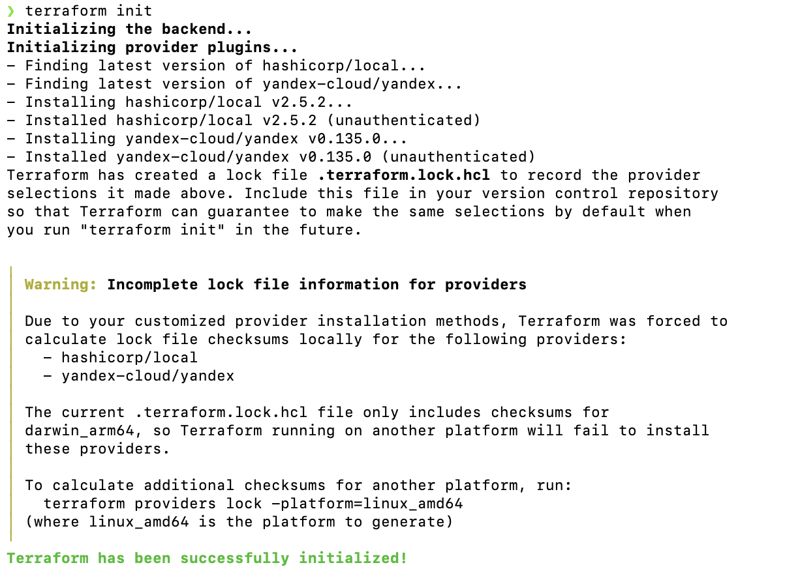

### Итог

После выполнения всех вышеуказанных шагов Terraform готов к использованию для развёртывания ресурсов в Yandex Cloud. Настроены необходимые конфигурационные файлы. Теперь можно приступать к написанию Terraform-кода для создания облачных ресурсов.


---

# Развёртка Terraform
После подготовки остальных ```.tf``` конфигов можно начинать развертку из папки Terraform.

- запуск развертки
```
./terraform apply
```
- получаем список IP-адресов (файл ```ansible_inventory.tf``` копирует адреса в файл ```/ansibe/hosts.ini```)

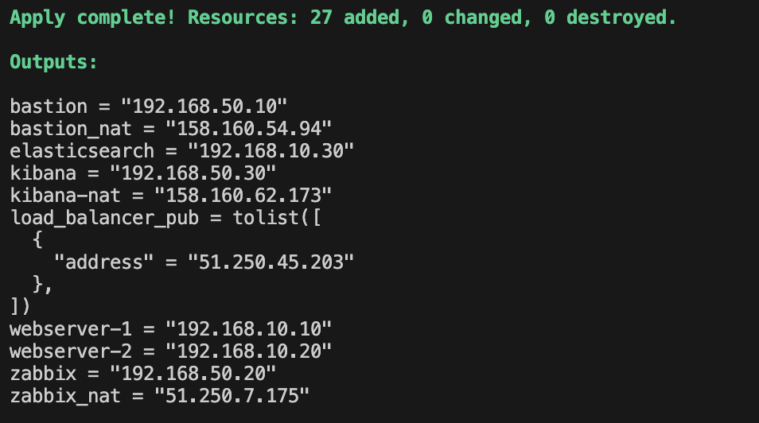

Проверка результата в Yandex Cloud:
- одна сеть bastion-network
- две подсети bastion-internal-segment и bastion-external-segment
- Балансировщик alb-lb с роутером web-servers-router, целевой группой tg-web

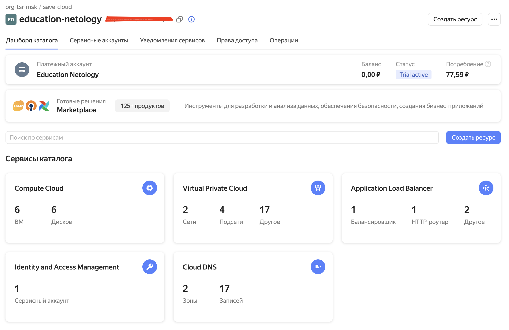

- 6 виртуальных машин

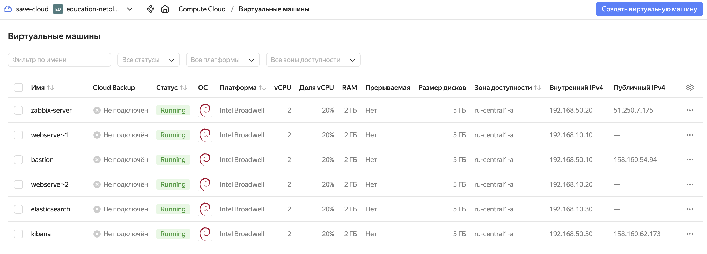

- 10 групп безопасности

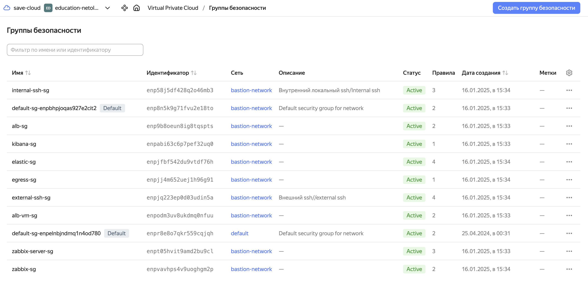

- ежедневные снимки дисков по расписанию


---

# Развёртка Ansible
- Первым делом, нужно установить Ansible

- Далее создадим папку с дистрибутивами

  ```/distribute``` и скачивание ```.deb``` пакетов elasticsearch, filebeat, kibana из [зеркала](https://mirror.yandex.ru/mirrors/elastic/) Яндекс. Версии должны быть одинаковыми и указываться в файле ```/ansible/elk/vars.yml```.

- создадим файл ```/ansible/ansible.cfg``` и проверим, что ансибл принял конфиг.
```
ansible --version
```


- запуск первого плейбука, который устанавливает ```roles``` и ```collections```
```
ansible-playbook playbook1.yml
```
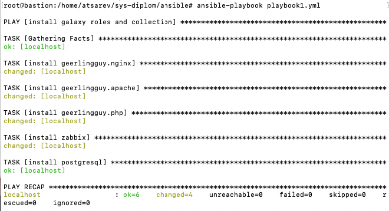

- запуск второго плейбука, который переносит и устанавливает все необходимые приложения, конфиги и ```html``` страницы
```
ansible-playbook playbook2.yml --vault-password-file pass -v
```

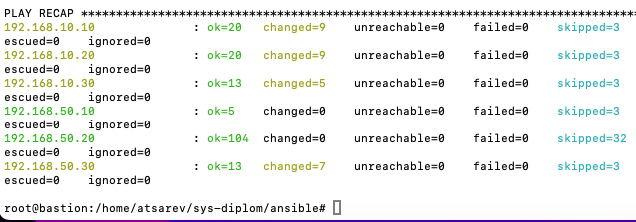

---

# Итоги
## Проверка работы балансировщика

```
curl -v 51.250.45.203:80
```
- либо зайти на сам [балансировщик](http://51.250.45.203)


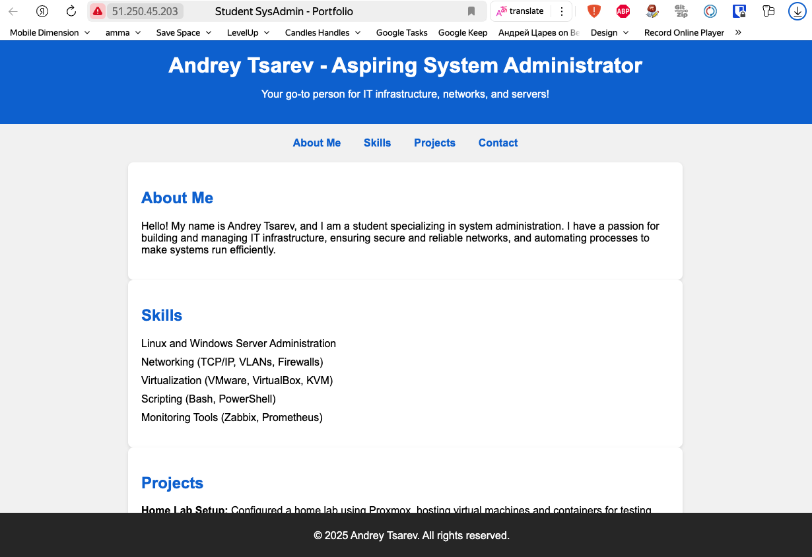

## Проверка работы Zabbix

 [Zabbix server](http://51.250.70.182/zabbix/) и сбора метрик 
 
 (Логин: Admin | Пароль: zabbix)

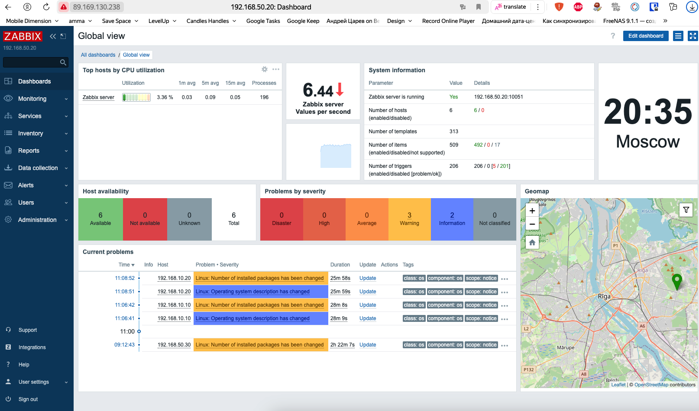

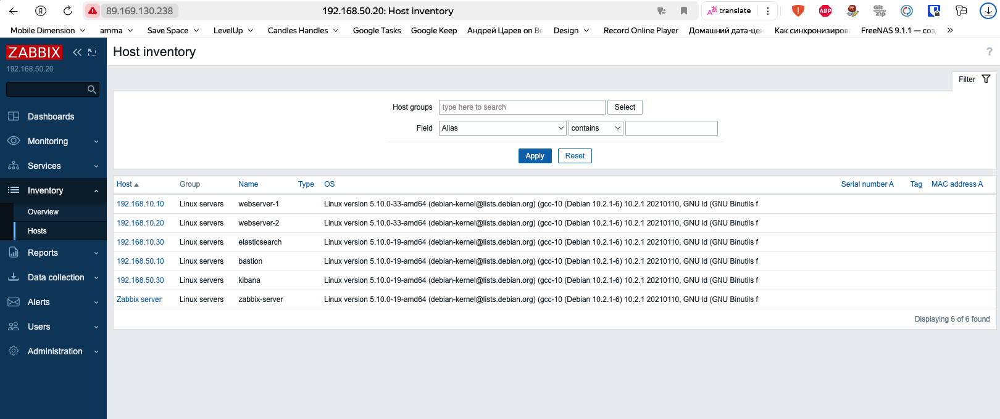
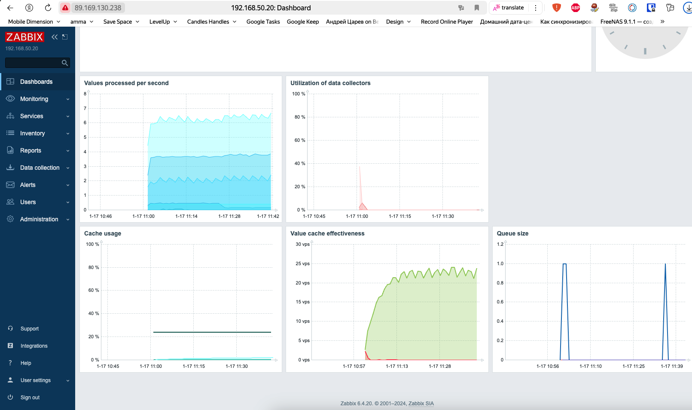


## Проверка работы ELK

[Elastic](http://62.84.125.240:5601) 

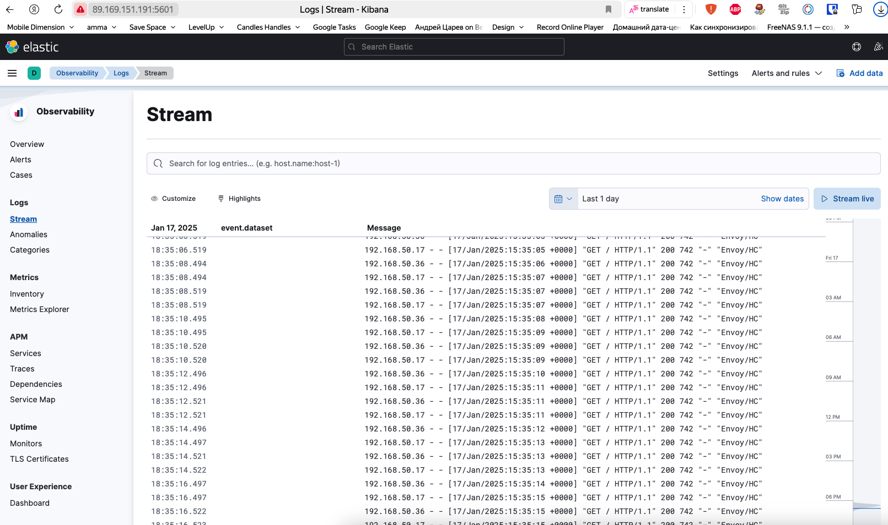
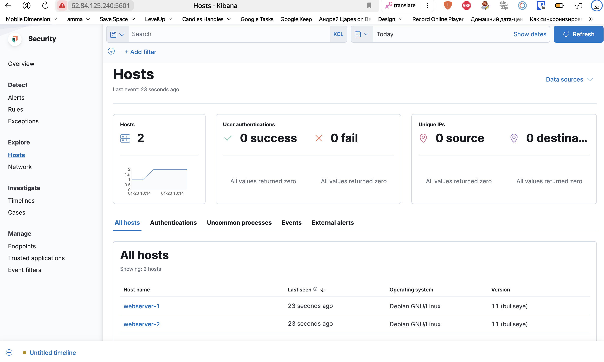